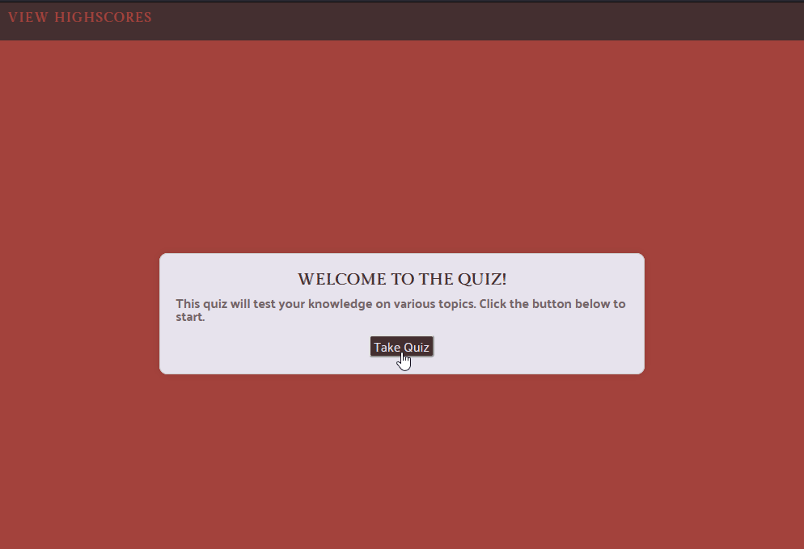

# 04 Web APIs: Code Quiz

## Description

This week's project was to build a code quiz, utilizing some of the Web API methods we learned in this module. The program includes a button to start the quiz, which also triggers a countdown (the duration of which can be modified easily in the JavaScript). The questions are multiple choice, and the interface gives feedback on whether the chosen answer was correct or incorrect. At the end of the quiz&mdash;or when time runs out&mdash;the user is prompted to enter their initials and they are added to the list of scores which are stored using the localStorage function. Once on the score screen there is an option to clear scores, or to retake the quiz.

## Live Website and Preview

[Link to Live Application](https://nihsad.github.io/code-quiz/)

